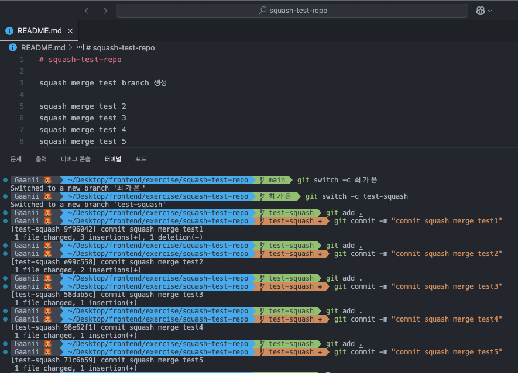
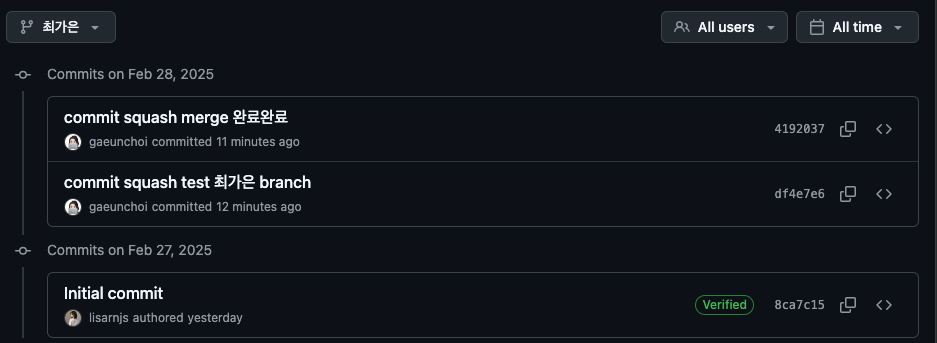

# Git squash & merge 실습 복기

## 😎 20250227 git squash & merge 과정을 복습해보자

---

### 1. `goorm-practice/squash-test-repo` clone

`Desktop/frontend/exercise` 폴더에 위 레포를 클론해오자.

```
git clone https://github.com/groom-practice/squash-test-repo.git
```

<br>

### 2. branch 생성

```
git switch -c 최가은
git switch -c test-squash
```

코드라인 1번을 이용해 `최가은` 이라는 브랜치를 생성하고, 2번을 이용해 `test-squash` 라는 브랜치를 생성했다.

<br>

### 3. 변경사항 생성



`test-squash` 브랜치에서 다섯개의 변경사항을 만들어 각각 commit 해줬다.

<br>

### 4. squash and merge 시작 !

```bash
git switch 최가은
git add .
git commit -m "최가은 브랜치서 커밋할거유 ~"
git merge --squash test-squash
```

위 코드를 따라 작성하면 충돌이 발생한다. 나는 “두 변경 사항 모두 수락”을 눌렀다.

이후 다시 add → commit→ push 해주기 !
이때 commit 메시지를 "squash merge 완료"라고 해줬다.



5개의 commit이 squash merge로 하나의 commit이 되는 모습을 볼 수 있다.
