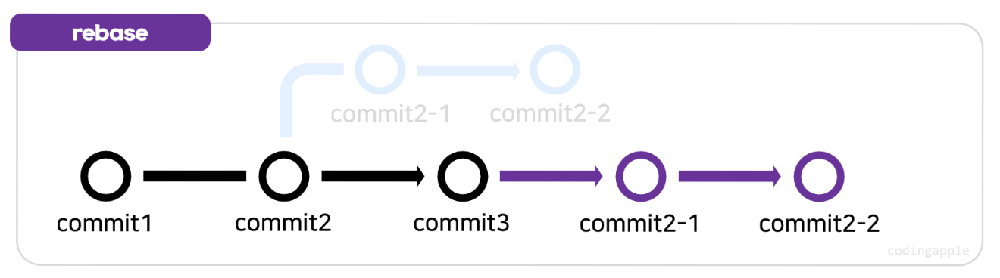
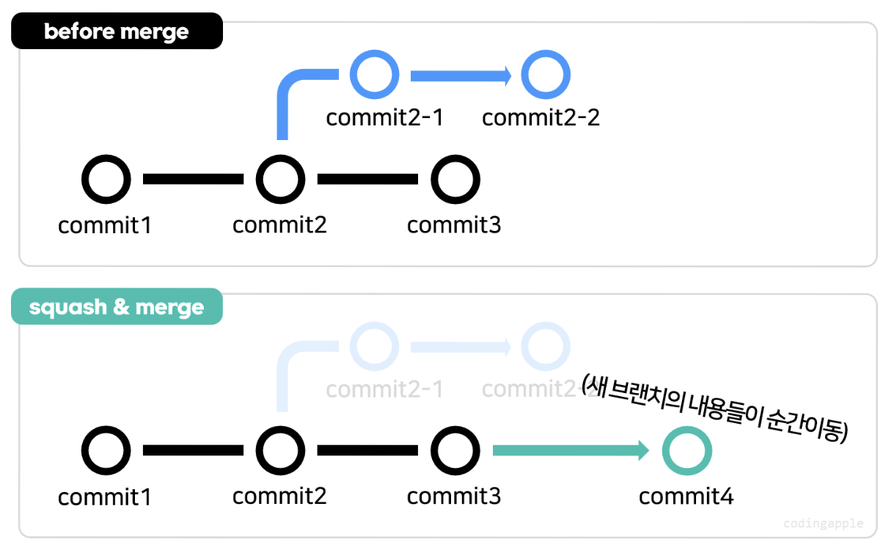

# 1️⃣ merge란 무엇인가 ?

---

`git merge <브랜치명>` 명령을 통해 현재 브랜치에 특정 브랜치를 병합한다.

즉, 두 개의 브랜치를 하나로 합치는 기능을 한다.  
<br>

# 2️⃣ merge의 방식

---

## [1] 3-way merge


검정색의 `main branch`에서 파란색의 `sub branch`를 뻗었다고 생각해보자.

분기된 상태에서 브랜치끼리 merge를 수행하게 되면 `commit 4`와 같이 새로운 `merge commit`이 생성된다.

<br>

## [2] fast-forward merge


위와 동일하게 검정색의 `main branch`에서 파란색의 `sub branch`를 뻗었다고 생각해보자.

새로운 `sub branch`에만 커밋이 있고 기준이 되는 `main branch` 에는 신규 커밋이 없을 때 `fast forward merge` 된다.

- ❓ 3-way merge와 다른 점
  `3-way merge` 는 새로운 merge commit이 생성되지만
  `fast-forward merge` 는 새로운 commit이 생성되지 않는다.

<br>

## [3] rebase and merge



`rebase` 란 말 그대로 베이스를 다시 설정한다는 의미를 가진다.

그렇다면, `rebase` 를 이용해서 새로운 브랜치의 시작점을 main 브랜치의 최근 commit으로 옮긴 후 `fast-forward merge` 를 수행하는 것이다.

이 경우에 `conflict` 이 자주 발생한다. 브랜치끼리 코드 변경 차이가 많을 경우 `rebase` 하면 충돌이 많이 발생하니 골머리 앓기 전에 짱구를 잘 굴리고 하자

- ❗️참고
  `rebase` 를 시작한 순간 절대절대 commit은 금지라고 한다.

<br>

## [4] squash merge



`squash merge` 는 여러개의 커밋을 하나의 commit으로 압축하여 병합하는 것이다.

다양한 브랜치에서 작업한 여러개의 작은 커밋을 한번에 메인 브랜치에 병합할 수 있다.

→ 커밋 히스토리가 깔끔해 지겠지 ?

→ 그러나, squash를 하게되면 모든 commit 이력이 하나의 commit으로 합쳐지고 사라진다는점 주의!

<br>

## [5] squash and merge with rebase

이 방법의 정식 명칭은 `Git rebase interactive` 라고 한다 → 기존의 commit을 수정, 삭제, 이동, 생성이 가능하다.

실습 하면서 가장 어려웠고 가장 멘붕왔던 부분이기도 하다 😔

아무튼 이부분만 실습에서 막혔으니까 리마인더 하기위해 코드 박제!

1. `git rebase -i <수정할 커밋의 직전 커밋 아이디>` `git rebase -i HEAD~<숫자>`

- 수정할 커밋의 직전 커밋 아이디는 `git log --oneline` 을 통해 확인할 수 있다.
- `git rebase -i HEAD~N` 는 최신 커밋으로부터 HEAD를 포함하여 N번째 커밋까지 가져온다는 의미이다.

2. 1번을 완료하면 5가지 옵션을 사용할 수 있다.

```
pick - 커밋 순서 재정렬, 해당 커밋을 수정 없이 그대로 사용
reword - 커밋 메시지 수정
edit - 커밋 수정
squash - 이전 커밋과 merge하여 단일 커밋으로 변경
fixup - squash와 비슷하지만 기존 커밋 메시지를 무시
drop - 커밋 삭제
```

3. 2번 중 원하는 동작을 선택 후 `git rebase --continue` 를 통해 작업 완료  
   이 때, `squash`를 할 경우 이전 커밋을 선택하면 안된다(에러남, 감자가 당해봤음)

<br>

## [참고사항] branch 삭제

3-way, fast-forward merge를 이용해 브랜치를 merge하고 나서 브랜치가 자동으로 삭제되는가? → ❌

따라서 `git branch -d <브랜치명>` `git branch -D <브랜치명>` 을 이용해서 필요없는 브랜치를 삭제해야한다.

- `git branch -d <브랜치명>` : 병합이 완료된 브랜치 삭제
- `git branch -D <브랜치명>` : 병합이 완료되지 않은 브랜치 삭제
