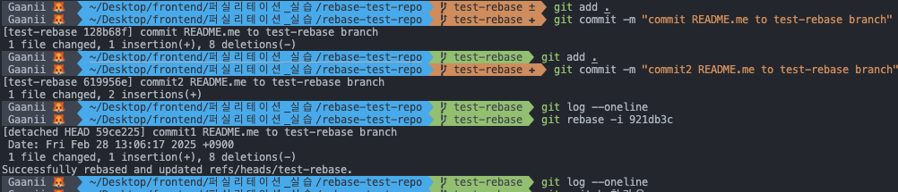
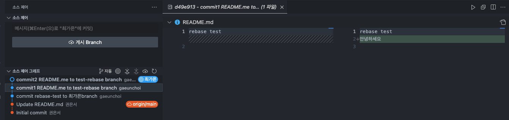
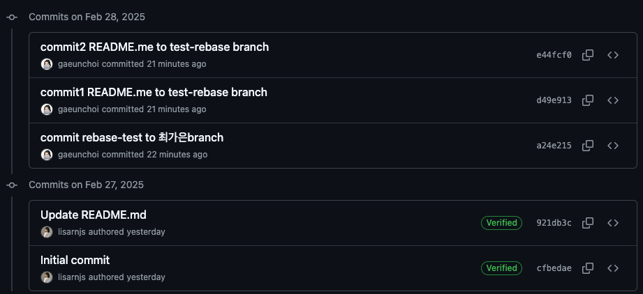

# Git rebase & merge 실습 복기

## 😎 20250227 git rebase & merge 과정을 복습해보자

---

### 1. `goorm-practice/rebase-test-repo` clone

`Desktop/frontend/exercise` 폴더에 위 레포를 클론해오자.

```
git clone https://github.com/groom-practice/rebase-test-repo.git
```

<br>

### 2. branch 생성

```
git switch -c 최가은
git switch -c test-rebase
```

코드라인 1번을 이용해 `최가은` 이라는 브랜치를 생성하고, 2번을 이용해 `test-rebase` 라는 브랜치를 생성했다.

<br>

### 3. 변경사항 생성

- `test-rebase` 브랜치에서 README.md 파일에 내용을 모두 지우고 “안녕하세요”를 적고 add→commit
- commit이 완료되었다면 이어서 “저는 최가은입니다” 문장을 추가하고 add→commit
- 이후 `최가은` 브랜치에서 README.md 파일에 내용을 모두 지우고 “rebase test”를 적고 add→commit
  > commit 메시지 변경을 해봤다
      
      `git rebase -i <수정할 커밋의 직전 커밋아이디>` 를 이용하여 첫번째 커밋 메시지를 수정했다
      commit README.md ~~ → commit1 README.md 이런식으로!
      네이밍 이렇게 하면 안되지만 일단 나 혼자 연습이니까~

<br>

### 4. rebase and merge 시작 !

```bash
git switch test-rebase
git rebase 최가은
```

`test-rebase` 브랜치로 이동 후 최가은 브랜치로 `rebase` 를 진행하려고 하면 충돌이 발생한다.

충돌 발생은 “두 변경 사항 모두 수락”을 눌러 냅다 합쳤다.



`최가은` 브랜치에서 `test-rebase`를 만들고 2번의 커밋을 더 해줬기 때문에 각 commit마다 비교해주며 충돌을 해결한다.

<br>

### 5. 올려보자 !

이 때, 바로 `add -> commit` 하면 안된다.

무슨 말이냐? 첫 번째 충돌 수정한 것을 `git add` 해주고, `git rebase --continue` 를 통해 충돌 상태를 해결한 후에 작업을 진행해야 한다.

결론적으로는 아래 코드처럼 따라가면 된다.

```bash
git add .
git rebase --continue
```

위 코드를 작성하면 vim이 뜨는데, 바로 `:wq` 를 이용해 빠져나오고 나서 다시 아래 코드를 따라가자.

```bash
git switch 최가은
git merge test-rebase
git push origin 최가은
```

<br>
결과적으로 얼레벌레 잘 올라간 것을 확인할 수 있다.


