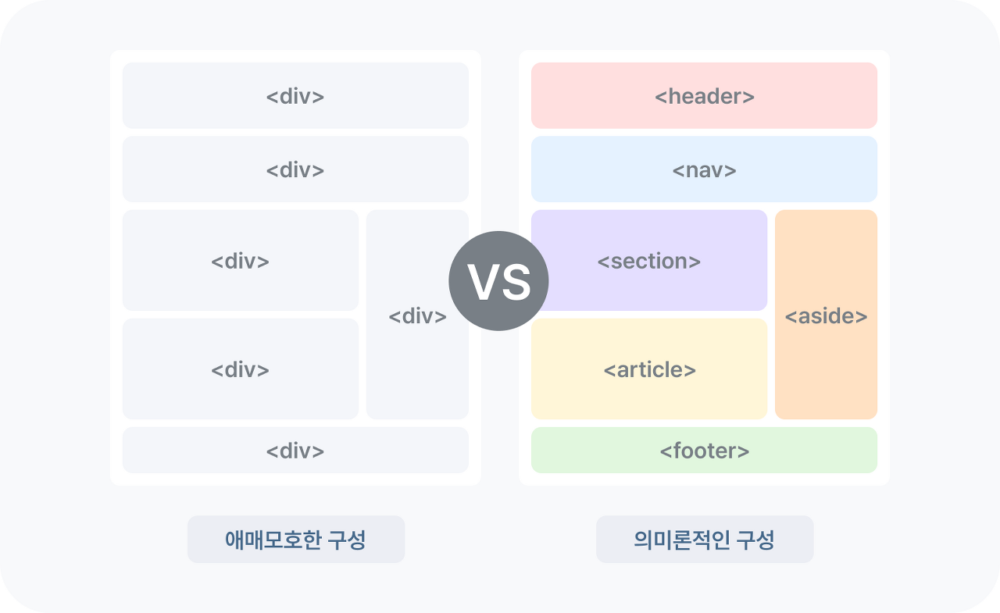

## 1️⃣ HTML이란?

### 💡 설명

`HTML = HyperText Markup Language`  
→ 마크업 언어는 자료의 구조(웹페이지)를 표현하기 위한 언어(프로그래밍 언어 ? ❌)  
→ 웹페이지의 내용(Content)와 구조(Structure)를 담당하는 언어로써 `HTML 태그` 를 통해 정보를 `구조화` 하는 것
<br>

✅ HTML 파일 기본 템플릿

```html
<!DOCTYPE html>
<html>
  <head>
    <meta charset="UTF-8" />
    <title>Document</title>
  </head>
  <body></body>
</html>
```

- `< >` 열린 태그 `< />` 닫힌 태그 : HTML은 열린 태그가 있다면 반드시 같은 단어로 닫힌 태그 있어야함
- `<!DOCTYPE html>` : 이 친구의 역할은 문서 형식(document type)을 HTML5로 지정
- `<html> </html>` : 실질적인 HTML document의 시작과 끝을 나타냄
- `<head> </head>` : document title, 외부 파일의 참조, 메타데이터 설정 등의 정보가 들어감
  - 이 정보들은 브라우저에 표시되지 X
- `<body> </body>` : 웹 브라우저에 출력되는 모든 요소 (웹페이지에 단 하나만 존재함)

<br>

## 2️⃣ Attribute(어트리뷰트)란?

### 💡 설명

`Attribute == 속성`
요소의 성질, 특징을 정의하는 명세, 즉 요소에 추가적인 정보를 제공

```html

```

- `src`: 이미지 파일의 경로와 파일명
- `width`: 이미지의 너비
- `height`: 이미지의 높이

→ 이 어트리뷰트들을 통해 정보들을 브라우저에 알려주는 것!

<br>

### 📋 Global Attributes 글로벌 어트리뷰트

| 속성     | 설명                                                                                       |
| -------- | ------------------------------------------------------------------------------------------ |
| id       | 유일한 식별자(id)를 요소에 지정한다. **중복 지정이 불가**하다.                             |
| class    | 스타일시트에 정의된 class를 요소에 지정한다. **중복 지정이 가능**하다.                     |
| hidden   | css의 hidden과는 다르게 의미상으로도 브라우저에 노출되지 않게 된다.                        |
| lang     | 지정된 요소의 언어를 지정한다. 검색엔진의 크롤링 시 웹페이지의 언어를 인식할 수 있게 한다. |
| style    | 요소에 인라인 스타일을 지정한다.                                                           |
| tabindex | 사용자가 키보드로 페이지를 내비게이션 시 이동 순서를 지정한다.                             |
| title    | 요소에 관한 제목을 지정한다.                                                               |

<br>

### 📋 HTML 기본 태그

- 웹페이지 구성 태그
  | 태그 | 설명 |
  | ------ | ---------------------------------------------------------- |
  | title | 문서의 제목으로 브라우저 탭에 표시 |
  | style | HTML 문서를 위한 style 정보를 정의, css 코드가 작성되는 곳 |
  | link | 외부 리소스(혹은 링크)와의 연결 |
  | script | javascript를 작성할 때 사용 |
  | meta | description, keywords, quthor, 기타 메타데이터 정의에 사용 |

  <br>

- 텍스트 관련 태그
  | 태그 | 설명 |
  | ------------------------------------------------------ | --------------------------------------------------------------------------------------------------------------- |
  | h1 ~ h6 | Headings 제목을 나타낼 때 사용 |
  | 숫자가 작을수록 중요한 제목을 의미하며, 크기가 커진다. |
  | strong, b | 두 태그 모두 볼드체를 지정한다.<br>`strong`: 의미론적(semantic) 중요성 O <br>`b`: 의미론적(semantic) 중요성 X |
  | em, i | empahsized, 강조 & 중요한 텍스트 지정<br>`em`: 의미론적(semantic) 중요성 O <br>`i`: 의미론적(semantic) 중요성 X |
  | sub, sup | `sub`: subscripted, 아래에 쓰인 텍스트<br>`sup`: superscripted, 위에 쓰인 텍스트 |
  | p | 단락, 문단을 지정 |
  | br | 강제 개행, 빈 요소로 닫는 태그 x |
  | pre | 파일에 작성된 그대로 브라우저에 표시 |
  | hr | 수평줄 삽입 |
  | q | 짧은 인용문 지정, 큰 따옴표로 보여짐 |
  | blockquote | 긴 인용문 지정, 들여쓰기 되어짐 |

  <br>

- 목록과 표 관련 태그

  | 태그  | 설명                             |
  | ----- | -------------------------------- |
  | ul    | 순서 없는 목록                   |
  | ol    | 순서 있는 목록                   |
  | table | 표를 감싸는 태그                 |
  | tr    | 표 내부의 행(row)                |
  | th    | 표 내부의 제목 셀(table heading) |
  | td    | 행 내부의 일반 셀(table data)    |

<br>

## 3️⃣ Semantice tag 시맨틱 태그

### 💡 설명

브라우저, 검색 엔진, 개발자 모두에게 컨텐츠의 의미를 명확히 설명하는 역할을 하는 태그 !  
웹 구문화를 통해 검색엔진의 보다 빠르고 정확한 크롤링을 가능하게 하여 SEO 최적화에 도움이 되고, 명확한 명칭의 태그로 빠른 구분이 가능하여 작업 효율이 증가하는 장점이 있다.

  
출처: [요즘 IT | 알아두면 쓸모 있는 시맨틱 마크업 개념 정리](<[https://yozm.wishket.com/magazine/detail/2495/](https://yozm.wishket.com/magazine/detail/2495/)>)

### ❓사용하는 이유

웹사이트는 검색 엔진에 노출되는 것이 매우 중요한데, SEO(Search Engine Optimization, 검색 엔진 최적화)를 위해 본인 웹사이트를 검색하기 알맞은 구조로 조정하기도 하는데 이 최적화를 잘해주려면 웹사이트 정보가 잘 수집된다는 것이 전제로 깔려야 한다.

→ 즉, 검색 엔진이 HTML 코드들로 해당 코드의 의미를 파악해야 해서 시맨틱 태그를 써야한다.

### ✅ 시맨틱 태그의 종류

| 태그    | 설명                                                                |
| ------- | ------------------------------------------------------------------- |
| header  | 사이트의 제목, 검색 창, 메뉴, 작성자 등                             |
| nav     | 메뉴바, 목차 등 문서끼리 연결하는 역할                              |
| aside   | 사이드(좌/우측 또는 하단)에 사이드바 영역을 표시                    |
| section | 본문의 여러 내용(article)을 포함하는 공간을 의미                    |
| article | 분문의 주내용이 들어가는 공간을 의미한다                            |
| footer  | 웹 문서 하단(사이트의 바닥)의 영역. 홈페이지 정보, 저작권 등을 표시 |

### 🧐 사용해야 하는 태그가 정해져있나요 ?

No! 각 요소마다 사용해야 하는 태그에 대한 정답은 없다. 개발자 본인이 판단해서 사용하면 된다.

<br>

## 4️⃣ 웹 표준 / 웹 접근성

1. 웹 표준([현재 웹 기술의 표준을 정의하는 W3C](<[https://www.w3.org/standards/](https://www.w3.org/standards/)>))
   표준화 된 언어를 사용하여 어떤 브라우저를 사용하더라도 동일한 결과물을 보여주는 것.  
   즉, **`어떤 운영체제나 브라우저에서든 동일한 컨텐츠를 볼 수 있도록 웹페이지를 만들 때 지켜야 하는 규칙`**을 의미<br>
   웹표준을 잘 지키면 → `운영 관리 용이`, `검색 엔진 최적화` , `웹 접근성 향상` 등의 장점이 있다.
   <br>

2. 웹 접근성
   누구에게나 동등한 기회 제공을 위해 장애인이나 고령자가 웹사이트에서 제공하는 정보를 비장애인과 동일하게 이용할 수 있도록 보장하는 것.  
   즉, **`누구나 신체적, 환경적 조건에 관계없이 인터넷을 통해 정보에 접근하고 이용할 수 있는지에 대한 정도`** 를 의미<br>
   → 어떻게 접근성을 높일까 ?

```html

```

이처럼, alt 속성이 인터넷 연결이 끊겨 이미지가 보이지 않을때 표시되는 대체 텍스트이기도 하면서, 시각 장애인분들이 스크린리더를 활용할 때 alt에 적힌 내용을 듣게 된다.

```html
<div>MODAL</div>
// ❌
<dialog>MODAL</dialog>
// ✅
```

modal 이라는 것을 웹사이트가 인식하려면 dialog 처럼 모달을 위한 태그를 사용해야 한다.

- dialog 가 제공하는 웹 접근성 기능
  - 포커스 관리 : 모달이 열리면 포커스 자동 이동
  - 접근성 트랩 : 포커스를 모달 안에 가두기
  - 모바일 네이티브 이벤트 구현 : 두 손가락 문지르기를 통한 모달 닫기 가능
- dialog 사용 방법
  - Show() : 비모달식 대화상자 오픈 → 외부요소와 상호작용O
  - ShowModal() : 모달식 대화상자 오픈 → 외부요소와 상호작용X
