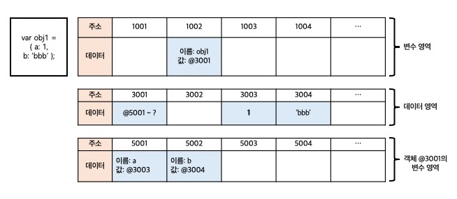

# 1️⃣ 데이터 타입의 종류

### 👉🏻 기본형 primitive type

- 숫자 Number
- 문자열 String
- 불리언 Boolean
- null
- undefined
- Symbol

### 👉🏻 참조형 reference type

- 객체 Object
- 배열 Array
- 함수 Function
- 날짜 Date
- 정규표현식 RegExp
- Map, WeakMap
- Set, WeakSet

### 👉🏻 `기본형` 과 `참조형` 의 구분법은 ?

`기본형` 은 할당이나 연산 시 값이 담긴 주솟값을 바로 복제하고, `참조형` 은 값이 담긴 주솟값들로 이루어진 묶음을 가리키는 주솟값을 복제한다.

<br>

# 2️⃣ 데이터 타입에 관한 배경지식

### 2-1. 메모리와 데이터

`비트 bit` : 0 또는 1만 표현할 수 있는 하나의 메모리 조각  
메모리는 매우 많은 비트들로 구성이 되며, 각 비트는 `고유한 식별자`를 통해 위치를 확인할 수 있다.  
but, 비트 단위로 위치를 확인하는 것은 매우 비효율적이기 때문에 적정한 공간을 묶어야 효율이 증가한다.

`바이트 byte` : 위에서 말한 비효율성을 줄이기 위해 비트를 묶어 구성한 것  
1바이트는 8개의 비트로 구성되어있고, 1비트마다 0 또는 1의 두 가지 값을 표현할 수 있으므로 1바이트는 총 256($2^8$)개의 값을 표현할 수 있다.


C/C++, 자바 등 정적 타입 언어는 데이터 타입별로 할당할 메모리 영역을 나누어 정해놓았기 때문에 표현 가능한 숫자의 범위가 정해져있다.

예를 들어, 2바이트 크기의 정수형 타입(short)는 -32768 ~ +32767의 숫자만 허용하고, 그 이상이나 이하의 숫자를 입력하면 오류가 나거나 잘못된 값이 저장된다.

그러나, `자바스크립트` 는 상대적으로 메모리 공간을 좀 더 넉넉하게 할당했다.
숫자의 경우 정수형인지 부동소수형인지를 구분하지 않고 64비트, 즉 8바이트를 확보한다.

앞서, `비트` 는 고유한 식별자를 지닌다고 했는데, `바이트` 는 바이트 단위의 식별자, 즉 `메모리 주솟값 memory address` 를 통해 서로 구분하고 연결할 수 있다.

### 2-2. 식별자와 변수

`변수 variable` : 변할 수 있는 데이터(숫자, 문자열, 객체, 배열 등)

`식별자 identifier` : 어떤 데이터를 식별하는데 사용하는 이름, 즉 `변수명`

<br>

# 3️⃣ 변수 선언과 데이터 할당

### 3-1. 변수 선언

```jsx
var a;
```

위 코드의 의미는 `변할 수 있는 데이터를 만들고, 이 데이터의 식별자는 a로 한다.` 가 된다.
→ 변수는 `변경 가능한 데이터가 담길 수 있는 공간 또는 그릇` 이라고 생각하면 된다.

위 코드를 작성했을 때 메모리 영역에서 어떻게 작업이 되어있는지는 아래 표로 확인할 수 있다.


명령을 받은 컴퓨터는 메모리에서 비어있는 공간 하나를 확보하고(위 예시는 임의로 1003으로 정함), 공간의 이름(식별자)를 a라고 지정한다.

### 3-2. 데이터 할당

```jsx
var a;
a = "abc";

var a = "abc";
```

`선언`과 `할당`을 1, 2번째 줄처럼 나누어 명령하든, 한 문장으로 명령하든 자바스크립트 엔진은 같은 동작을 수행한다.

메모리 공간을 확보하고서 그 공간의 이름(식별자)를 설정하는 `선언` 과정은 앞의 과정과 동일하며, `할당` 과정은 a라는 이름을 가진 주소를 검색해서 그곳에 문자열 ‘abc’를 할당하면 된다.

이 때, 실제로 해당 위치에 문자열 ‘abc’를 직접 저장하지 않는다. 즉, 데이터를 저장하기 위한 별도의 메모리 공간을 다시 확보해 문자열 ‘abc’를 저장하고, 그 주소를 변수 영역에 저장한다.


1. 변수 영역에서 빈 공간(`@1002`)를 확보
2. 확보한 공간의 식별자를 a로 지정
3. 데이터 영역의 빈 공간(`@3003`)에 문자열 ‘abc’ 저장
4. 변수 영역에서 a라는 식별자 검색(`@1002`)
5. 3에서 저장한 문자열의 주소(`@3003`)를 `@1002`의 공간에 대입
   → `@1002`의 주소로 찾아가면 그 안에 식별자:a, 값: `@3003`라는 정보가 있고, `@3003`에 찾아가면 ‘abc’ 데이터 존재

> 👌🏻 변수 영역 / 데이터 영역

    이 둘을 구분해서 설명하는 문서는 없다.(정식 명칭 x)
    책에서는 변수가 저장되는 영역과 실제 데이터가 저장되는 영역을 구분해서 위처럼 이름지었다.

> ❓ 왜 변수 영역에 값을 직접 대입하지 않나요 ?
> 데이터 변환을 자유롭게 할 수 있게 함과 동시에 메모리를 더욱 효율적으로 관리하기 위해서이다. <br>  
>  만약 미리 확보한 공간 내에서만 데이터 변환을 할 수 있다면 변환한 데이터를 다시 저장하기 위해서 `확보된 공간을 변환된 데이터 크기에 맞게 늘리는 작업` 을 선행해야하는데, 중간에 있는 데이터를 늘려야하면 처리해야 할 연산이 늘어나 효율이 떨어진다. <br>

    따라서 메모리를 효율적으로 관리하기 위해서 `변수와 데이터를 별도의 공간에 나누어 저장` 하는 것이 최적이다.

<br>

# 4️⃣ 기본형 데이터와 참조형 데이터

### 4-1. 불변값

`변수 variable` vs. `상수 constant` 를 구분하는 성질은 `변경 가능성` 이다.

**변수 영역 메모리를** 바꿀 수 있으면 `변수`, 바꿀 수 없으면 `상수`

→ 데이터 할당이 한 번 이뤄진 변수 공간에 다른 데이터를 재할당 할 수 있는지 여부가 관건이다.

`불변값` vs. `가변값` 을 구분할 때 변경 가능성의 대상은 **데이터 영역 메모리 이다.**

기본형 데이터는 모두 불변값이다.

```jsx
// 새로운 문자열 'abcdef'를 만들어 데이터영역에 저장하고, 그 주소를 변수 a에 대입한다.
var a = "abc";
a = a + "def";

// 처음 b를 선언하고 할당할 때 데이터 영역에 5가 없으니
// 새로운 데이터 공간을 만들어 저장하고 그 주소를 b에 대입한다.
// c를 선언하고 할당할 땐 데이터 영역에 기저장된 5의 주소를 재활용해 c에 대입한다.
// b의 값을 변경할 땐 데이터 영역에 7이 없으니 새로운 데이터 공간을 만들어 저장한다.
// 즉, 5, 7은 다른 값을 변경할 수 없고 변수에서 새로운 값이 필요하면 새로 만들어야한다.
var b = 5;
var c = 5;
b = 7;
```

### 4-2. 가변값

기본형 데이터는 모두 불변값이면 참조형 데이터는 모두 가변값인가 ?

→ ❌ NO ! 기본적인 성직은 가변값인 경우가 많지만 설정에 딸 ㅏ변경 불가능한 경우도 있고, 아예 불변값으러 활용하는 방안도 있다.

- 참조형 데이터 변수 할당 과정

```jsx
var obj1 = {
  a: 1,
  b: "bbb",
};
```



1. 변수 영역의 빈 공간(`@1002`)를 확보하고, 그 주소의 이름을 obj1으로 지정
2. 임의의 데이터 저장 공간(`@3001`)에 데이터를 저장하려고 보니, 여러개의 프로퍼티로 이뤄진 데이터 그룹이다. 이 그룹 내부의 프로퍼티들을 저장하기 위해 별도의 변수 영역을 마련하고, 그 영역의 주소(`@5001~?`)를 `@3001`에 저장한다.
3. `@5001` 및 `@5002`에 각각 a, b라는 프로퍼티 이름을 지정한다.
4. 데이터 영역에서 숫자 1을 검색하고 결과가 없으므로 임의로 `@3003`에 저장하고 해당 주소를 `@5001`에 저장한다. 문자열 ‘bbb’ 도 임의로 `@3004`에 저장하고 이 주소를 `@5002`에 저장한다.

👉🏻 기본형 데이터와의 차이는 `객체의 변수(프로퍼티) 영역`이 별도로 존재한다는 점이다.

- 중첩 객체 프로퍼티 할당

```jsx
var obj = {
  x: 3,
  arr: [3, 4, 5],
};
```


### 4-3. 변수 복사 비교

```jsx
var a = 10;
var b = a;

var ojb1 = { c: 10, d: "ddd" };
var obj2 = obj1;
```

변수를 복사하는 과정은 기본형 데이터와 참조형 데이터 모두 같은 주소를 바라보게 되는 점에서 동일하다.

하지만, **데이터 할당 과정에서 이미 차이가 존재**하기 때문에 변수 복사 이후 동작에서 차이가 발생한다.

`기본형`은 주솟값을 복사하는 과정이 한 번만 이뤄지고, `참조형`은 한 단계를 더 거치게 된다는 차이가 있다.

<br>

# 5️⃣ 불변 객체

### 5-1. 불변 객체를 만드는 간단한 방법

참조형 데이터도 데이터 자체를 변경하고자 하면 기존 데이터는 변하지 않는다.

그렇다면, 내부 프로퍼티를 변경할 필요가 있을 때 마다 매번 새로운 객체를 만들어 재할당하거나 자동으로 새로운 객체를 만드는 도구(immutable.js, immer.js, immutability-helper 등)을 사용하면 객체의 불변성을 확보할 수 있을것이다.

> ❓어떤 상황에서 불변 객체가 필요할까 ?

    값으로 전달받은 객체에 변경을 가하더라도 원본 객체는 변하지 않아야 하는 상황 !

### 5-2. 얕은 복사와 깊은 복사

- `얕은 복사 shallow copy`: 바로 아래 단계의 값만 복사하는 방법
- `깊은 복사 deep copy`: 내부의 모든 값들을 하나하나 찾아서 복사하는 방법

깊은 복사를 위해서는 재귀적으로 수행을 하거나 객체를 문자열로 전환했다가 다시 JSON 객체로 바꾸는 방법 등을 활용할 수 있다.

> 💡 얕은 복사 예시

```js
var copyObj = function (target) {
  var result = {};
  for (var prop in target) {
    result[prop] = target[prop];
  }
  return result;
};

var user = {
  name: "gaanii",
  favorite: {
    hobby: "drive",
    food: "chicken",
    fruit: "apple",
  },
};

var user2 = copyObj(user);

user2.name = "change gaanii";
console.log(user.name === user2.name); // false

user2.favorite.fruit = "banana";
console.log(user.favorite.fruit === user2.favorite.fruit); // true
```

얕은 복사 → 중첩된 객체에서 참조형 데이터가 저장된 프로퍼티 복사 시 주솟값만 복사하기에, 사본을 바꾸면 원본도 바뀐다.

> 💡 깊은 복사 예시

```js
var copyObjDeep = function (target) {
  var result = {};
  if (typeof target === "object" && target !== null) {
    for (var prop in target) {
      result[prop] = copyObjDeep(target[prop]);
    }
  } else {
    result = target;
  }
  return result;
};

var user = {
  name: "gaanii",
  favorite: {
    hobby: "drive",
    food: "chicken",
    fruit: "apple",
  },
};

var user2 = copyObjDeep(user);

user2.name = "change gaanii";
console.log(user.name === user2.name); // false

user2.favorite.fruit = "banana";
console.log(user.favorite.fruit === user2.favorite.fruit); // false
```

`copyObjDeep` 함수 내에서 target이 객체인 경우 내부 프로퍼티들을 순회하며 `copyObjDeep` 함수를 재귀적으로 호출하고, 객체가 아닌 경우 target을 그대로 지정한다. <br>
깊은 복사는 얕은 복사와 다르게 마지막 콘솔을 찍으면 false가 나온다.

<br>

# 6️⃣ undefined와 null

javascript에는 ‘없음’을 나타내는 값으로 `undefined`와 `null`을 사용할 수 있다.

- `undefined`: **값이 대입되지 않은** 변수 혹은 속성을 사용하려고 할 때 반환된다.

  ```js
  var tmp;
  console.log(tmp); // undefined
  ```

  사용자가 명시적으로 지정할 수도 있고, JS 엔진이 자동으로 부여하는 경우도 있다.

  JS 엔진은 사용자가 어떤 값을 지정할 것이라고 예상하지만, 실제로 그러지 않았을 때 `undefined`를 반환하고 다음 세 경우가 이에 해당한다.

  1. 값이 할당되지 않은 변수에 접근하는 경우
  2. 내부에 존재하지 않는 프로퍼티에 접근하는 경우
  3. return 문이 없거나 호출되지 않은 함수의 실행 결과

- `null`: **객체가 없음**을 나타낸다.

둘 다 사용할 수 있는 값이지만, ‘**현재 값이 없다**’는 의미로 데이터 타입을 직접 넣어줄 때는 **`undefined`보다 `null`이 더 적합**하다.

<br><br>

# 🧹 정리

- 자바스크립트 데이터 타입에는 크게 `기본형`과 `참조형`이 있고, 기본형은 불변값이고 참조형은 가변값이다.
- `변수`는 변경 가능한 데이터가 담길 수 있는 공간이고, `식별자`는 그 변수의 이름을 말한다.
- 변수를 선언하면 컴퓨터는 우선 메모리의 빈 공간에 식별자를 저장하고, 그 공간에 자동으로 `undefined`를 할당한다. 이 후 그 변수에 기본형 데이터를 할당하려고 하면 별도의 데이터 공간에 데이터를 저장하고, 그 공간의 주소를 변수의 값 영역에 할당한다.
- 참조형 데이터를 가변값으로 여겨야 하는 상황임에도 이를 불변값으로 사용하려면 ? → 내부 프로퍼티들을 일일이 복사하면 된다(깊은 복사).
- ‘없음’을 나타내는 값은 두가지로, `undefined`는 어떤 변수에 값이 존재하지 않을 경우를 의미하고 `null`은 사용자가 명시적으로 ‘없음’을 표현하기 위해 대입한 값이다.
