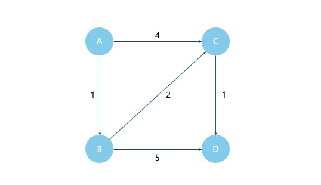
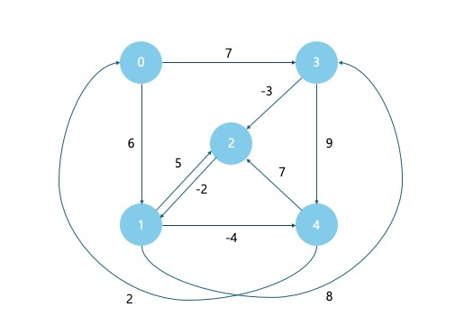

## Dijkstra Algorithm

> DP를 활용한 대표적인 최단경로(거리) 탐색 알고리즘  
> **가중치(거리)가 모두 양수인 그래프**에서, 시작 정점으로 부터 다른 모든 정점까지의 최단거리 계산

### 동작 방식

1. 시작 노드의 거리는 0으로, 나머지는 무한대(Infinity)로 초기화
2. 방문하지 않은 노드 중에서 현재까지 가장 짧은 거리의 노드 선택
3. 해당 노드를 거쳐 인접 노드로 가는 새로운 거리 계산 → 만약 더 짧다면 값 갱신
4. 모든 노드를 방문할 때 까지 반복

### 코드 예시



```jsx
function dijkstra(graph, start) {
  const dist = {};
  const visited = {};
  const queue = [];

  for (let node in graph) {
    dist[node] = Infinity;
  }
  dist[start] = 0;
  queue.push([0, start]);

  while (queue.length) {
    queue.sort((a, b) => a[0] - b[0]);
    const [curDist, curNode] = queue.shift();

    if (visited[curNode]) continue;
    visited[curNode] = true;

    for (let [nextNode, d] of graph[curNode]) {
      let newDist = curDist + d;
      if (newDist < dist[nextNode]) {
        dist[nextNode] = newDist;
        queue.push([newDist, nextNode]);
      }
    }
  }

  return dist;
}

const graph = {
  A: [
    ["B", 1],
    ["C", 4],
  ],
  B: [
    ["C", 2],
    ["D", 5],
  ],
  C: [["D", 1]],
  D: [],
};

console.log(dijkstra(graph, "A"));
// {A: 0, B: 1, C: 3, D: 4}
```

<br>

## Bellman-Ford Algorithm

> 다익스트라와 달리 **음수인 가중치(거리)도 포함된 그래프**에서 최단거리 계산

### 동작 방식

1. 시작 노드의 거리는 0으로, 나머지는 무한대(Infinity)로 초기화
2. 모든 간선을 확인하며 거리 갱신을 V-1번 반복(V : 전체 노드 개수)
3. 음수 사이클 유무 확인

### 코드 예시



```jsx
function bellmanFord(edges, V, start) {
  const dist = Array(V).fill(Infinity);
  dist[start] = 0;

  for (let i = 0; i < V - 1; i++) {
    for (let [u, v, d] of edges) {
      if (dist[u] !== Infinity && dist[u] + d < dist[v]) {
        dist[v] = dist[u] + d;
      }
    }
  }

  for (let [u, v, d] of edges) {
    if (dist[u] !== Infinity && dist[u] + d < dist[v]) {
      return "음수 사이클 존재!";
    }
  }

  return dist;
}

const edges = [
  [0, 1, 6],
  [0, 3, 7],
  [1, 2, 5],
  [1, 3, 8],
  [1, 4, -4],
  [2, 1, -2],
  [3, 2, -3],
  [3, 4, 9],
  [4, 0, 2],
  [4, 2, 7],
];

const result = bellmanFord(edges, 5, 0);
console.log(result);
// [0, 2, 4, 7, -2]
```

<br>

## Dijkstra vs. Bellman-Ford 비교

| 알고리즘     | 음수 거리 | 음수 사이클 탐지 | 시간 복잡도    | 속도 |
| ------------ | --------- | ---------------- | -------------- | ---- |
| Dijkstra     | 불가능    | 불가능           | O((V + E)logV) | 빠름 |
| Bellman-Ford | 가능      | 가능             | O(V × E)       | 느림 |
