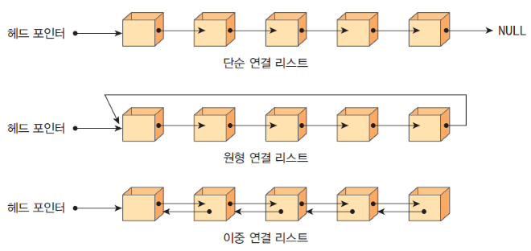

# 연결 리스트 Linked List

> `노드 Node`들이 `포인터 Pointer`를 이용해 일렬로 연결된 자료구조

- 각 노드는 데이터와 다음 노드를 가리키는 포인터로 구성
- 노드간의 연결만으로 이루어져 있기 때문에 삽입/삭제에 유리
- `head`와 `tail` 포인터로 연결리스트의 시작과 끝을 감지
  <br>

## 배열과의 차이점

| 항목      | 배열 (Array) | 연결리스트 (Linked List) |
| --------- | ------------ | ------------------------ |
| 메모리    | 연속적       | 비연속적                 |
| 삽입/삭제 | 느림 (O(n))  | 빠름 (O(1) 또는 O(n))    |
| 접근 속도 | 빠름 (O(1))  | 느림 (O(n))              |
| 크기 변경 | 불편         | 유연                     |

<br>

## 종류


출처: [https://masterpiece-programming.tistory.com/61](https://masterpiece-programming.tistory.com/61)

### 1. 단일 연결 리스트 Singly Linked List

- 각 노드가 다음 노드만 가리켜 순방향 탐색만 가능

### 2. 이중 연결 리스트 Doubly Linked List

- 각 노드가 이전 노드와 다음 노드를 모두 가리켜 양방향 탐색 가능

### 3. 원형 연결 리스트

- 마지막 노드의 포인터가 첫 노드를 가리켜 무한 루프 가능
  <br>

## 장/단점

### 장점

- 중간에 삽입/삭제가 빠름(위치를 알 경우)
- 크기 제한 없이 유연하게 확장 가능

### 단점

- 인덱스로 접근이 느림
- 포인터 관리가 필요 → 구현이 복잡
  <br>

## 코드 예시 (이중 연결 리스트)

```jsx
class Node {
  constructor(v) {
    this.val = v;
    this.prev = null;
    this.next = null;
  }
}

class DoublyLinkedList {
  constructor() {
    this.head = null;
    this.tail = null;
    this.length = 0;
  }

  // 맨 뒤에 삽입
  insertLast(v) {
    const newNode = new Node(v);

    if (!this.head) this.head = this.tail = newNode;
    else {
      this.tail.next = newNode;
      newNode.prev = this.tail;
      this.tail = newNode;
    }
    this.length++;
  }

  // 맨 앞에 삽입
  insertFirst(v) {
    const newNode = new Node(v);
    if (!this.head) this.head = this.tail = newNode;
    else {
      newNode.next = this.head;
      this.head.prev = newNode;
      this.head = newNode;
    }
    this.length++;
  }

  // 특정 위치에 삽입
  insertAfter(targetVal, v) {
    let cur = this.head;
    while (cur) {
      if (cur.val === targetVal) {
        const newNode = new Node(v);
        newNode.next = cur.next;
        newNode.prev = cur;

        if (cur.next) cur.next.prev = newNode;
        else this.tail = newNode;

        cur.next = newNode;
        this.length++;
        return;
      }
      cur = cur.next;
    }
  }

  // 맨 앞 삭제
  removeFirst() {
    if (!this.head) return;

    if (this.head === this.tail) this.head = this.tail = null;
    else {
      this.head = this.head.next;
      this.head.prev = null;
    }
    this.length--;
  }

  // 맨 뒤 삭제
  removeLast() {
    if (!this.tail) return;

    if (this.head === this.tail) this.head = this.tail = null;
    else {
      this.tail = this.tail.prev;
      this.tail.next = null;
    }
    this.length--;
  }

  // 특정 값 삭제
  remove(v) {
    let cur = this.head;
    while (cur) {
      if (cur.val === v) {
        if (cur.prev) cur.prev.next = cur.next;
        else this.head = cur.next;

        if (cur.next) cur.next.prev = cur.prev;
        else this.tail = cur.prev;

        this.length--;
        return;
      }
      cur = cur.next;
    }
  }

  // 전체 리스트 출력
  printList() {
    let cur = this.head;
    const result = [];
    while (cur) {
      result.push(cur.val);
      cur = cur.next;
    }
    console.log("List:", result.join(" <-> "));
  }
}

const dList = new DoublyLinkedList();

dList.insertLast(10);
dList.insertLast(20);
dList.insertFirst(30);
dList.insertAfter(10, 40);
dList.printList(); // 30 <-> 10 <-> 40 <-> 20

dList.removeFirst();
dList.printList(); // 10 <-> 40 <-> 20

dList.remove(40);
dList.printList(); // 10 <-> 20

dList.removeLast();
dList.printList(); // 10
```
