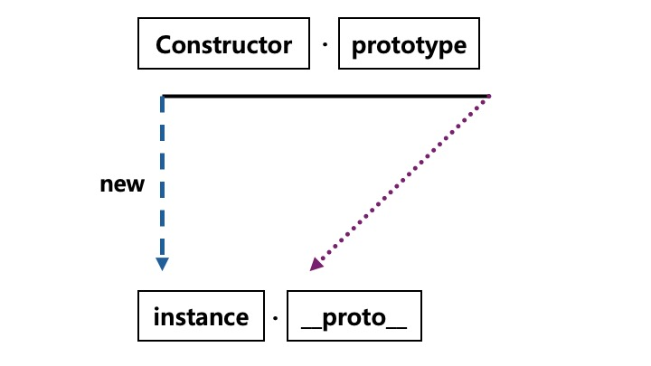
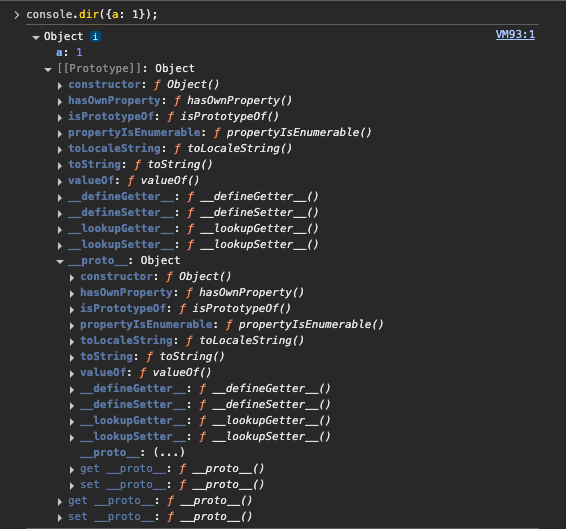

# 프로토타입 prototype

자바스크립트는 프로토타입 기반 언어이기 때문에 Java, Python 등 클래스 기반의 객체 지향 언어와 다른 특징을 가지고 있다. 후자는 **상속**이라는 개념을 사용하지만 자바스크립트는 어떤 객체를 **원형(prototype)**으로 삼고 이것을 **복제(참조)**함으로써 상속과 비슷한 효과를 얻는다.

## 1️⃣ 프로토타입의 개념 이해

### 6-1-1. constructor, prototype, instance

```jsx
var instance = new Constructor();
```



- 어떤 생성자 함수 `Constructor`를 `new` 연산자와 함께 호출하면
- Constructor에서 정의된 내용을 바탕으로 새로운 `instance`가 생성된다.
- 이 때 instance에는 `__proto__`라는 프로퍼티가 자동으로 부여되는데,
- 이 프로퍼티는 Constructor의 prototype이라는 프로퍼티를 참조한다.
- `__proto__` 를 읽을 때는 **던더 프로토 dunder proto**라고 읽는다. double underscore의 줄임말이다.

```jsx
var Person = function (name) {
  this._name = name;
};

Person.prototype.getName = function () {
  return this._name;
};

var suzi = new Person("Suzi");
suzi.__proto__.getName(); // undefined
suzi.getName(); // Suzi
```

❗️ 여기서 메서드 호출 결과로 undefined가 나오는데

- 이 변수가 **호출할 수 있는 함수에 해당**한다는 것을 의미
- 만약 실행할 수 없는, 즉 함수가 아닌 다른 데이터 타입이었다면 ? TypeError 발생
- 결론적으로, 에러가 아닌 다른 값이 나왔으므로 getName이 실제로 실행되었음을 의미하고, 이로부터 getName이 함수라는 것이 입증된다.

❓그럼 왜 undefined가 출력되는가 ?

this에 바인딩 된 대상이 잘못 지정됐기 때문이다. this는 suzi가 아닌 `suzi.__proto__`라는 객체이기 때문에 undefined가 리턴된다. [[참고] 코어자바스크립트 3장 this](https://velog.io/@gaeunchoi/%EB%B6%81%EC%8A%A4%ED%84%B0%EB%94%94-%EC%BD%94%EC%96%B4%EC%9E%90%EB%B0%94%EC%8A%A4%ED%81%AC%EB%A6%BD%ED%8A%B8-3%EC%9E%A5-this)

### 6-1-2. constructor 프로퍼티

생성자 함수의 프로퍼티인 Prototype 내부에는 constructor라는 프로퍼티가 있다.

인스턴스의 \_\_proto\_\_ 객체 내부에도 마찬가지다. 원래의 생성자 함수(자기 자신)을 참조하는데, 인스턴스로부터 그 원형을 알 수 있는 수단이기 때문이다.

```jsx
let arr = [1, 2];
Array.prototype.constructor == Array; // true
arr.__proto__.constructor == Array; // true
arr.constructor == Array; // true

let arr2 = new arr.constructor(3, 4);
console.log(arr2); // [3, 4]
```

- constructor는 읽기 전용 속성이 부여된 예외적인 경우(기본형 리터럴 변수 - number, string, boolean)를 제외하고는 값을 바꿀 수 있다.
- constructor를 변경하더라도 참조하는 대상이 변경될 뿐 이미 만들어진 인스턴스의 원형이 바뀐다거나 데이터 타입이 변하는 것은 아니다.
- 어떤 인스턴스의 생성자 정보를 알아내기 위해 constructor 프로퍼티에 의존하는것이 항상 안전하지는 않다.

## 2️⃣ 프로토타입 체인

### 6-2-1. 메서드 오버라이드

- 메서드 오버라이드: 객체가 자신의 프로토타입으로부터 상속받은 메서드를 덮어쓰는 것
- 메서드 위에 메서드를 덮어씌웠다는 표현 → 원본을 제거하고 다른 대상으로 교체하는 것이 아닌 원본이 그대로 있는 상태에서 다른 대상을 그 위에 얹는 것!
- 즉, 객체에 동일한 이름의 메서드를 정의하면 프로토타입 체인에서 이 객체의 메서드가 우선 호출된다.

```jsx
var Person = function (name) {
  this.name = name;
};

Person.prototype.getName = function () {
  return this.name;
};

var iu = new Person("지금");
iu.getName = function () {
  return "바로 " + this.name;
};

console.log(iu.getName()); // "바로 지금"
```

### 6-2-2. 프로토타입 체인



- 객체의 \_\_proto\_\_ 속성 안에는 또 다른 \_\_proto\_\_ 속성이 포함되어 있으며, 이는 프로토타입 객체가 객체이기 때문에 발생한다.

- 프로토타입 체인: 어떤 데이터의 \_\_proto\_\_ 프로퍼티 내부에 다시 \_\_proto\_\_ 프로퍼티가 연쇄적으로 이어진 것
- 프로토타입 체이닝: 프로토타입 체인을 따라가며 검색하는 것

```jsx
var arr = [1, 2];

Array.prototype.toString.call(arr); // 1, 2
Object.prototype.toString.call(arr); // [object Array]
arr.toString(); // 1, 2

arr.toString = function () {
  return this.join("_");
};

arr.toString(); // 1_2
```

### 6-2-3. 객체 전용 메서드의 예외사항

- 모든 생성자 함수의 prototype은 객체이므로, Object.prototype이 언제나 프로토타입 체인의 최상단에 존재하며 이로인해 Object.prototype에 정의된 메서드는 모든 데이터 타입에서 접근이 가능하다.
- Object.prototype에 객체에서만 사용할 의도로 메서드를 추가해도, 객체가 아닌 데이터 타입(number, string, booelan 등)도 이 메서드에 접근할 수 있어 예상한 결과와 다른 결과를 얻을 수 있다.

```jsx
Object.prototype.getEntries = function () {
  let res = [];
  for (let prop in this) {
    if (this.hasOwnProperty(prop)) {
      res.push([prop, this[prop]]);
    }
  }
  return res;
};
let data = [
  ["object", { a: 1, b: 2, c: 3 }], // [["a",1], ["b",2],["c",3]]
  ["number", 345], // []
  ["string", "abc"], // [["0","a"], ["1","b"], ["2","c"]]
  ["boolean", false], // []
  ["func", function () {}], // []
  ["array", [1, 2, 3]], // [["0", 1], ["1", 2], ["2", 3]]
];
data.forEach(function (datum) {
  console.log(datum[1].getEntries());
});
```

- 따라서 객체 전용 메서드는 Object.prototype이 아닌 특정 객체에 직접 부여해야한다.

> 💡 Object.prototype에는 모든 데이터타입에서 사용할 수 있는 범용적인 메서드만 정의하는것이 안전하다!

### 6-2-4. 다중 프로토타입 체인

자바스크립트의 기본 내장 데이터타입들은 모두 프로토타입 체인이 1단계(객체)이거나 2단계(나머지)로 끝나는 경우만 있었지만 사용자가 새롭게 만드는 경우에는 그 이상도 얼마든지 가능하다.

대각선의 \_\_proto\_\_를 연결해나가기만 하면 무한대로 체인관계를 이어나갈 수 있다.

```jsx
var Grade = function () {
  var args = Array.prototype.slice.call(arguments); // 인자 배열로 변환
  for (let i = 0; i < args.length; i++) {
    this[i] = args[i]; // Grade 객체의 속성으로 인자 할당
  }
  this.length = args.length; // Grade 객체의 length 속성 설정
};

var g = new Grade(100, 80);
```
