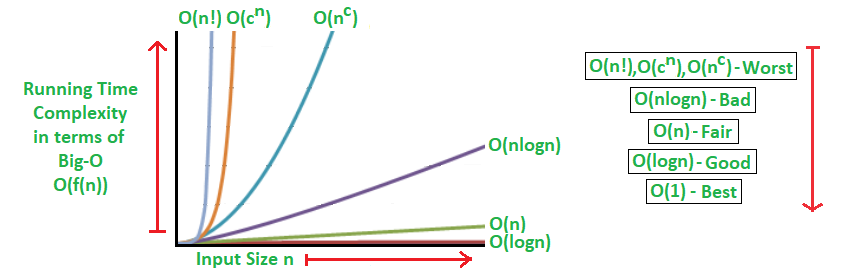

# 1️⃣ 복잡도

복잡도란 알고리즘의 성능, 효율성을 나타내는 척도이다.

크게, `시간 복잡도`와 `공간 복잡도`로 나누어 볼 수 있다.

## 1. 시간 복잡도 Time Complexity

`시간 복잡도`란 특정 크기의 입력을 기준으로 할 때 필요한 연산의 횟수를 의미한다.

## 2. 공간 복잡도 Space Complexity

`공간 복잡도`란 알고리즘이 실행될 때 얼마나 많은 공간(메모리)가 필요한지를 의미한다.

## 3. 시간 복잡도 vs 공간 복잡도

시간 복잡도는 얼마나 빠르게 실행되는지, 공간 복잡도는 얼마나 많은 메모리가 필요한지를 판단한다.

시간 복잡도와 공간 복잡도는 반비례하는 경향이 있기 때문에, 알고리즘의 성능을 판단할 땐 `시간 복잡도`를 위주로 판단한다.

<br>

# 2️⃣ 빅오 Big-O Notation

- 복잡도를 나타내는 점근 표기법 중 가장 많이 사용되는 표기법
- 알고리즘 효율성을 상한선 기준으로 표기 → 즉, 알고리즘 최악의 경우를 고려하는데 가장 좋은 표기법

> 빅오메가는 하한선을 기준으로, 빅세타는 상한선과 하한선 사이를 기준으로 표기

## 1.  빅오 표기법 특징

1. 상수항, 계수 무시

   빅오 표기법은 n이 충분히 크다고 가정을 하고, 알고리즘의 효율성은 n의 크기에 영향을 받기 때문이다.

   → O(n+5)는 O(n)으로, O(2n)은 O(n)으로 간주한다.

2. 영향력 없는 항 무시

   빅오 표기법은 n의 크기에 영향을 받으므로 가장 영향력이 큰 항 이외에 영향력이 없는 항은 무시한다.

   → O($n^2 + 2n + 1$)은 O($n^2$)으로 간주한다.

## 2. 시간 복잡도 + 빅오 표기법



> $O(1) < O(log n) < O(n) < O(n logn) < O(n^2) < O(2^n)$ < $O(n!)$

| 복잡도       | 소요 시간      | 예시                                                                                      |
| ------------ | -------------- | ----------------------------------------------------------------------------------------- |
| $O(1)$       | 상수 시간      | 스택에서 Push, Pop                                                                        |
| $O(log n)$   | 로그 시간      | 이진 트리                                                                                 |
| $O(n)$       | 선형 시간      | 1중 for 문                                                                                |
| $O(n log n)$ | 선형 로그 시간 | 퀵 정렬(quick sort), 병합 정렬(merge sort), 힙 정렬(heap sort)                            |
| $O(n^2)$     | 2차 시간       | 이중 for 문, 삽입 정렬(insertion sort), 거품 정렬(bubble sort), 선택 정렬(selection sort) |
| $O(C^n)$     | 지수 시간      | 피보나치 수열                                                                             |
| $O(n!)$      | 팩토리얼 시간  | 순열(permutation), 조합(combination)                                                      |

### 2-1. O(1): 상수 시간 복잡도

입력값(n)이 증가하더라도 실행시간은 변하지 않는 알고리즘

입력값의 크기와 관계없이 즉시 출력값을 얻을 수 있다.

```jsx
const sum = ((n + 1) * n) / 2;
```

### 2-2. O($logn$): 로그 시간 복잡도

입력값의 크기가 커질수록 실행 시간이 로그(지수 함수의 역함수)만큼 짧아지는 알고리즘

```jsx
function printNum(n) {
  let i = 1;
  while (i < n) {
    console.log(i);
    i = i * 2;
  }
}
```

### 2-3. O($n$): 선형 시간 복잡도

입력값의 증가도에 따라 시간도 동일한 비율로 증가하는 알고리즘

```jsx
let sum = 0;
for (let i = 0; i <= n; i++) {
  sum += i;
}
```

### 2-4. O($nlogn$): 선형 로그 시간 복잡도

O(n) 알고리즘과 O(logn)의 알고리즘이 중첩된 것이다.

데이터가 많아질수록 성능이 향상되고, 거의 모든 정렬 알고리즘이 이 복잡도이다.

```jsx
// 고기 순서대로 정렬하는 코드
function sortMeats(meats) {
  if (meats.length <= 1) {
    return meats; // 고기 1개만 있으면 바로 리턴
  }

  const mid = Math.floor(meats.length / 2); // 고기를 반으로 자름

  // 여기서 왼쪽 고기와 오른쪽 고기를 재귀 함수로 계속 쪼갬
  // 더 이상 쪼갤 수 없을 때 (1개 남을 때) 쪼개기를 멈춤
  const left = sortMeats(meats.slice(0, mid)); // 왼쪽 고기 정렬
  const right = sortMeats(meats.slice(mid)); // 오른쪽 고기 정렬

  return merge(left, right); // 이제 두 조각을 비교하면서 다시 합침
}

function merge(left, right) {
  let result = [];
  let i = 0;
  let j = 0;

  // 양쪽 고기를 비교해서 순서대로 합쳐줌
  while (i < left.length && j < right.length) {
    if (left[i] < right[j]) {
      result.push(left[i]);
      i++;
    } else {
      result.push(right[j]);
      j++;
    }
  }

  // 남은 고기들 다 넣어줌
  return result.concat(left.slice(i)).concat(right.slice(j));
}

// 👉 쪼개는 데 걸리는 시간 → O(log n)
// 👉 합치는 데 걸리는 시간 → O(n)
// => O(n log n)
```

### 2-5. O($n^2$): 2차 시간 복잡도

입력값이 증가함에 따라 시간이 n의 제곱수의 비율로 증가하는 알고리즘

```jsx
function printNum(n) {
  for (let i = 0; i <= n; i++) {
    for (let j = 0; j <= n; j++) {
      console.log(i, j);
    }
  }
}
```

### 2-6. O($2^n$): 지수 시간 복잡도

주로 재귀적으로 수행하는 알고리즘으로, 모든 경우의 수를 탐색할 때 나온다.

```jsx
function fibonacci(n) {
  if (n <= 1) return n;
  return fibonacci(n - 1) + fibonacci(n - 2);
}
```

### 2-7. O($n!$): 팩토리얼 시간 복잡도

순열, 조합 알고리즘에서 나온다.

```jsx
function arrangeCars(cars) {
  if (cars.length === 0) {
    return [[]]; // 아무 차도 없으면 빈 배열 하나 리턴
  }

  let result = [];
  for (let i = 0; i < cars.length; i++) {
    let remaining = cars.slice(0, i).concat(cars.slice(i + 1)); // i번째 차를 뺌
    let perms = arrangeCars(remaining); // 나머지 차들 순서를 구함

    for (let perm of perms) {
      result.push([cars[i], ...perm]); // i번째 차 + 나머지 차들 조합
    }
  }
  return result;
}
```

## 3. 공간복잡도 + 빅오 표기법

알고리즘 실행에 메모리가 얼마나 사용되는지를 계산하면 된다.
