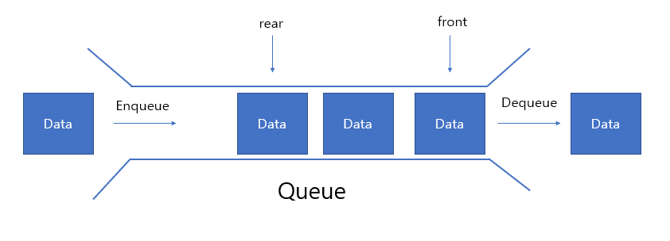

# **📌 스택 Stack**

> **후입선출(LIFO, Last In First Out)** 방식으로 데이터를 처리하는 자료구조


출처: [https://velog.io/@hyhy9501/3-1.-스택Stack](https://velog.io/@hyhy9501/3-1.-%EC%8A%A4%ED%83%9DStack)

## 주요연산

- `push`: 스택의 맨 위에 새로운 항목 추가
- `pop`: 스택의 맨 위에 있는 항목을 제거하고 그 항목을 리턴
- `peek`: 스택의 맨 위에 있는 항목에 접근해 값만 리턴(제거 x)
- `isEmpty`: 스택이 비어있는지 확인
- `size`: 스택의 크기 확인

## 장점

- 구현이 간단하고 효율적
- 메모리 관리가 자동으로 이루어짐

## 단점

- 크기가 제한될 수 있음

## 코드

```jsx
class Stack {
  constructor() {
    this.items = [];
  }

  push(element) {
    this.items.push(element);
  }

  pop() {
    if (this.isEmpty()) return "스택이 비었습니다";
    return this.items.pop();
  }

  peek() {
    if (this.isEmpty()) return "스택이 비었습니다";
    return this.items[this.items.length - 1];
  }

  isEmpty() {
    return this.items.length === 0;
  }

  size() {
    return this.items.length;
  }
}

const stack = new Stack();
stack.push(1);
stack.push(2);
console.log(stack.peek()); // 2
console.log(stack.pop()); // 2
console.log(stack.pop()); // 1
```

<br>

# **📌 큐 Queue**

> 선입선출(FIFO, First In First Out) 방식으로 데이터를 처리하는 자료구조



출처: [https://velog.io/@hyhy9501/3-1.-큐Queue](https://velog.io/@hyhy9501/3-1.-%ED%81%90Queue)

## 주요 연산

- `enqueue`: 큐의 맨 뒤에 새로운 항목 추가
- `dequeue`: 큐의 맨 앞에 항목을 제거하고 그 항목을 리턴
- `front`: 큐의 맨 앞에 항목에 접근해 값만 리턴(제거 x)
- `isEmpty`: 큐가 비어있는지 확인
- `size`: 큐의 크기 확인

## 장점

- 삽입과 삭제가 효율적이다
- 데이터 처리 순서가 명확하다

## 단점

- 배열을 이용해서 구현할 경우, dequeue()에서 O(n)의 시간 복잡도 발생

## 코드

```jsx
class Queue {
  constructor() {
    this.items = [];
  }

  enqueue(element) {
    this.items.push(element);
  }

  dequeue() {
    if (this.isEmpty()) return "큐가 비었습니다";
    return this.items.shift();
  }

  front() {
    if (this.isEmpty()) return "큐가 비었습니다";
    return this.items[0];
  }

  isEmpty() {
    return this.items.length === 0;
  }

  size() {
    return this.items.length;
  }
}

const queue = new Queue();
queue.enqueue(1);
queue.enqueue(2);
console.log(queue.front()); // 1
console.log(queue.dequeue()); // 1
console.log(queue.dequeue()); // 2
```
