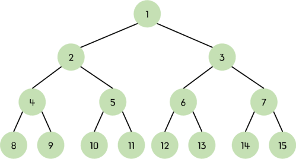

# 📌 힙 Heap

> 💡 **완전 이진 트리(Complete Binary Tree)**의 일종으로, 모든 노드의 값이 특정 규칙을 만족하는 자료구조

> ❓ 완전 이진 트리  
> <br>이진 트리 구조에서 모든 레벨이 꽉 차 있거나, 마지막 레벨을 제외한 모든 노드가 채워져있는 이진트리이다.<br>마지막 레벨의 노드들은 왼쪽부터 순서대로 차있다.<br>출처 : https://chamdom.blog/binary-tree/

<br>

## 종류

### 최소 힙 Min Heap

> 💡 부모 노드의 값이 자식 노드의 값보다 작거나 같은 완전 이진 트리

```jsx
          1
        /   \
       3     6
      / \   / \
     5   9 8   7
```

- 루트 노드가 가장 작은 값을 가진다
- 우선순위 큐(Priority Queue) 구현에 많이 사용된다

<br>

### 최대 힙 Max Heap

> 💡 부모 노드의 값이 자식 노드의 값보다 크거나 같은 완전 이진 트리

```jsx
          9
        /   \
       7     8
      / \   / \
     5   3 6   1
```

- 루트 노드가 가장 큰 값을 가진다
- 힙 정렬(Heap Sort)에 사용되며, 최댓값 또는 최솟값을 빠르게 추출하는데 유용하다

<br>

### 특징

- 완전 이진 트리로 구현된다
- 삽입, 삭제 연산의 시간 복잡도는 O(log n)이다
- 배열을 사용하여 효율적으로 구현이 가능하다

<br>

# 📌 힙 정렬 Heap Sort

> 💡 힙 자료구조를 기반으로 한 정렬 알고리즘
> 일반적으로 최대 힙 Max Heap을 이용하여 오름차순 정렬을 수행

## 동작 과정

1. 주어진 배열을 최대 힙으로 변환 (Heapify 과정)
2. 루트 노드(가장 큰 값)와 배열의 마지막 요소를 교환
3. 힙의 크기를 줄이고, 다시 최대 힙의 특성을 유지하도록 조정
4. 위 과정을 모든 요소에 대해 반복하여 정렬

<br>

## 장점

- 시간 복잡도가 안정적으로 O($n log n$)을 유지
- 추가 메모리가 거의 필요하지 않음

<br>

## 단점

- 구현이 복잡
- 안정 정렬(Stable Sort)이 아님

<br>

## 시간/공간 복잡도

- 시간 복잡도: O($n log n$) → 최선, 평균, 최악 모두 동일
- 공간 복잡도: O(1) → 추가 메모리 사용 없음

<br>

## 코드

```jsx
function heapify(arr, size, root) {
  let largest = root;
  const left = 2 * root + 1;
  const right = 2 * root + 2;

  if (left < size && arr[left] > arr[largest]) largest = left;
  if (right < size && arr[right] > arr[largest]) largest = right;

  if (largest !== root) {
    [arr[root], arr[largest]] = [arr[largest], arr[root]];
    heapify(arr, size, largest); // 재귀적으로 변경된 노드에 대해 heapify 수행
  }
}

function buildMaxHeap(arr) {
  const len = arr.length;

  for (let i = Math.floor(len / 2) - 1; i >= 0; i--) {
    heapify(arr, len, i);
  }
}
function heapSort(arr) {
  const len = arr.length;

  // 최대 힙 변환
  buildMaxHeap(arr);

  // 하나씩 추출하여 정렬
  for (let i = len - 1; i > 0; i--) {
    [arr[0], arr[i]] = [arr[i], arr[0]];
    heapify(arr, i, 0);
  }
  return arr;
}

console.log(heapSort([5, 3, 8, 4, 2])); // [2, 3, 4, 5, 8]
```
